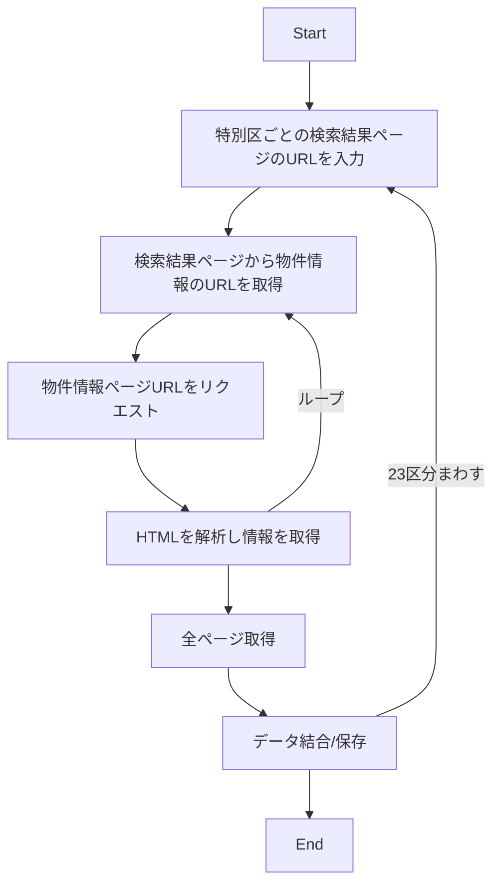

# 東京 23 区にある賃貸物件の家賃予測

## ゴール

&emsp;賃貸物件情報サイトに掲載されている物件データを使って家賃価格を予測するモデルを作成しよう。 
このデータは 2023 年 7 月時点に web 情報サイトに掲載された約 60 万レコードの賃貸物件情報で、その対象エリアは東京 23 区です。このうち全体の 5%を test データに分割しました。参加者は残りのデータを使って予測モデルを作成し、test データの賃貸物件に対する管理費を含まない一か月分の家賃価格を予測します。 
&emsp;目的変数である家賃は 3 万円台から 300 万円まで幅広いレンジを持ち、東京の各特別区特有の特徴を示しています。最も賃貸物件数が多いのは世田谷区ですが、賃料の分散が大きいのは港区です。また、世帯人数が多いと予想される東京郊外部の例えば杉並区と都心部のオフィス街とは部屋の間取りや地価に起因して家賃分布が異なっていることでしょう。test データは各特別区から物件数と家賃価格の分散を考慮してランダムに抽出したものから構成されています。つまり N 数と分散が大きくなると test データに占めるその特別区の割合が増える最適配分法を採用している点にご注意ください。 
&emsp;説明変数は"間取り", "専有面積", "向き", "築年数", "最寄り駅", "周辺情報"などからなる 17 次元のデータです。ただし、例えば"option"のような、一部正規化されていないデータもあるため、データ加工も課題解決にあたり重要なステップとなりえます。

## 参加手順

1. 自分の名前で`master`からブランチを切る
1. `Dataset\resources.zip`を解凍する
1. `Notebooks`配下に自分の名前でフォルダを作成、モデル開発する
1. 適宜コミット、プッシュして予測モデルをつくる
1. 予測結果は`Submit`フォルダに格納する
1. `master`マージすると結果が`Leaderboard\result.txt`に表示される
1. コードレビューしてほしいときはプルリクを投げよう

## レギュレーション

1. 本データと本データを使用して作成した成果物は外部公開禁止（web 公開などは禁止）
2. データ取得元の営業を妨害する行為はしないこと
3. `master`ブランチへの直接コミットは禁止、 また`master`ブランチへのマージは頻繁にやらないように（GitHub Actions が 2000min./月しか動けないので）
4. 外部データの使用は OK、ただし学習に使ったデータは`Dataset`に格納し、取得手順などを`Description`で説明すること （参加者全員が活用できる状況にすること）
5. 使用ツールの制限はなし、なんでも OK、ただし実行手順を明確にすること（他人が実行できる手順を示すこと）
6. 提出ファイルは何枚でも OK、ファイル名は誰が提出したか判別できるようにすること

## データ

`Dataset\resources.zip`

-   `train.csv`
    学習用データ
-   `test.csv`
    テストデータ
-   `rough_submit.csv`
    提出ファイルのサンプル
    特別区と間取りの中央値で予測

|           column           | dtype | note                                                           |
| :------------------------: | :---: | :------------------------------------------------------------- |
|          `index`           |  INT  | key train と test で共有                                       |
|           `rent`           |  INT  | 家賃                                                           |
|       `room_layout`        |  STR  | 間取り                                                         |
|        `floor_area`        | FLOAT | 床面積                                                         |
|          `facing`          |  STR  | 主採光面の方角                                                 |
|           `type`           |  STR  | 建物の種別　例）マンション、一戸建て                           |
|   `age_of_construction`    |  STR  | 築年数                                                         |
|          `train`           |  STR  | 最寄り駅                                                       |
|         `location`         |  STR  | 物件が特定できない程度の住所                                   |
|          `option`          |  STR  | その他の設備等                                                 |
|    `room_layout_detail`    |  STR  | 間取り詳細                                                     |
|        `structure`         |  STR  | 構造　例）鉄筋コン                                             |
|          `floor`           |  STR  | 部屋の階数/総階数                                              |
|   `year_of_construction`   |  STR  | 建築年月日                                                     |
|         `parking`          |  STR  | 駐車場について                                                 |
|        `conditions`        |  STR  | 条件                                                           |
|       `total_rooms`        |  STR  | 総戸数                                                         |
| `neighborhood_information` |  STR  | 近隣情報                                                       |
|           `URL`            |  STR  | 物件情報 URL （更新日によってはページが存在しない場合あり） |

## 評価指標

[Symmetric mean absolute percentage error](https://en.wikipedia.org/wiki/Symmetric_mean_absolute_percentage_error)

$SMAPE=\dfrac{1}{n}\normalsize\displaystyle\sum_{t=1}^n\dfrac{|F_t-A_t|}{(|A_t|+|F_t|)/2}$

$A_t$ is the actual value and $F_t$ is the forecast value.

## Deadline

**2023-09-29 12:00:00.000000(UTC+0900)**

この時点での順位をレポートにまとめて報告します。 
`master`へのマージはこれ以降も OK

**2023-10-27 12:00:00.000000(UTC+0900)**

2 次締め切り日

## 参考

### スクレイピング手順

※重複データは削除してある。 複数の仲介業者が同じ物件を扱っている場合があり、取得したデータ 120 万件のうち約 80 万件が重複データ

